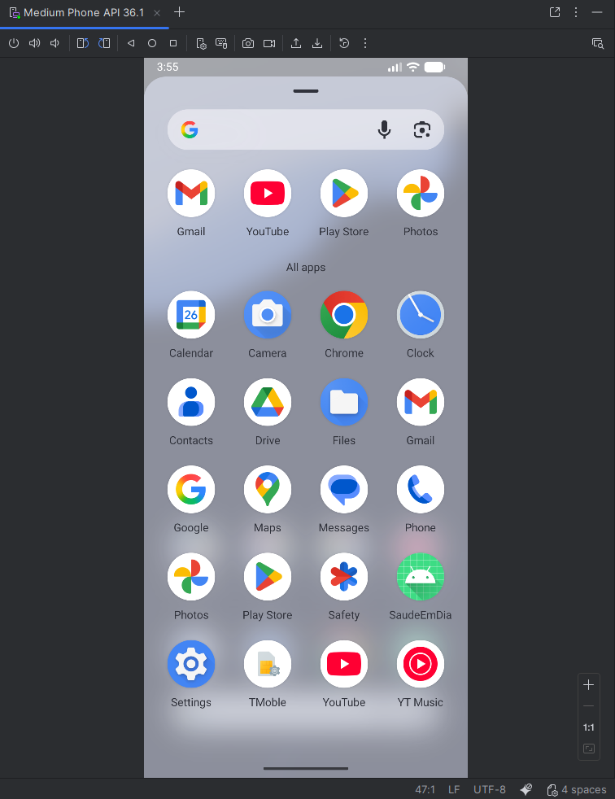
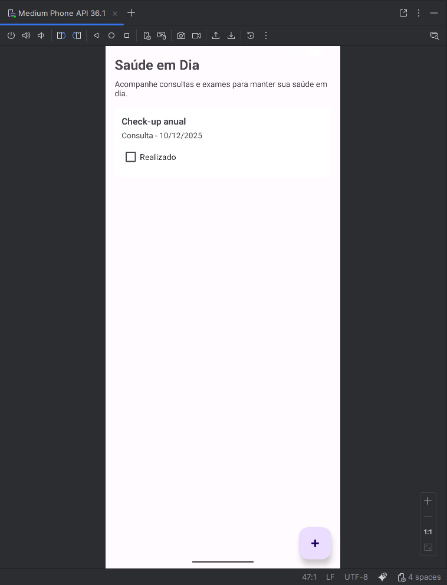
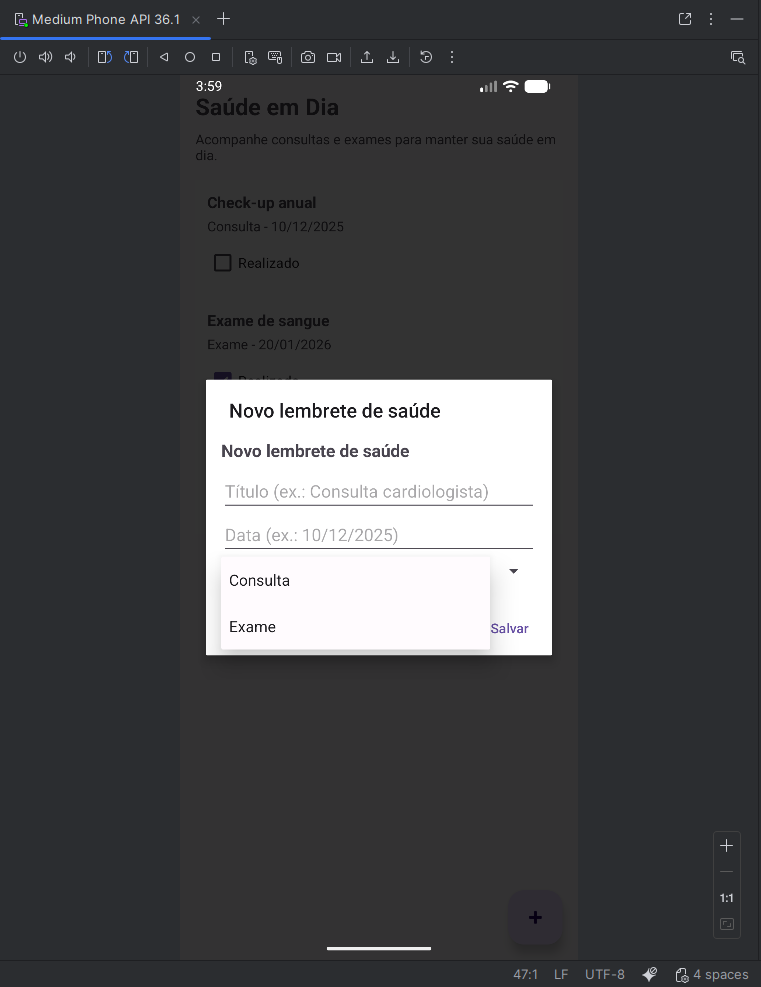
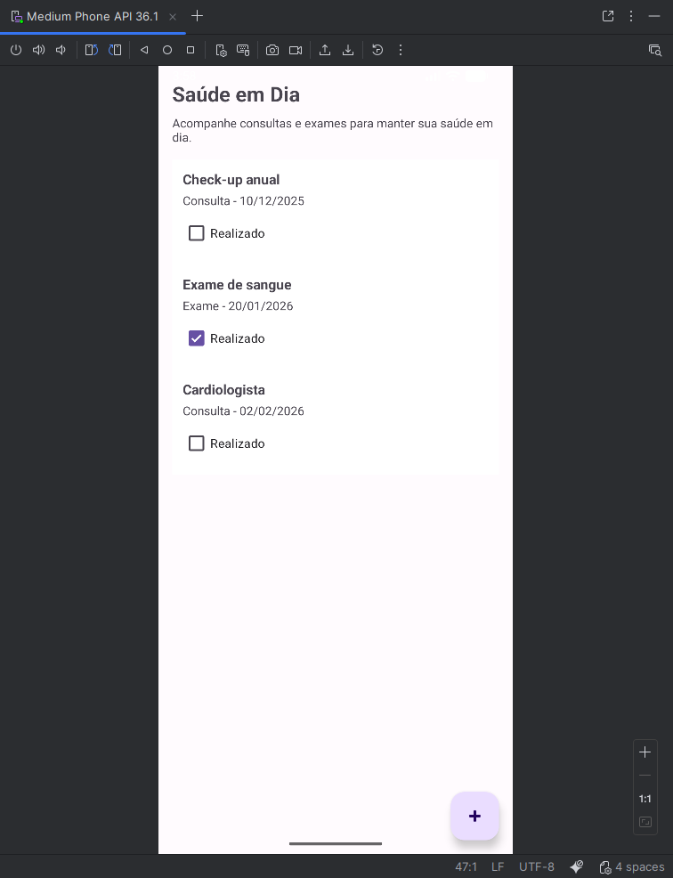

# Programação para dispositivos móveis
Alunos:
- Rodrigo Fortes Lopes (72450238)
- Launelle Cardozo Martins (72450328)

link para GitHub: https://github.com/rodrigo-fortes/saude-em-dia

(*) Projeto executado na IDE Android Studio com auxílio da ferramenta de Inteligência Artificial ChatGPT.

# 🩺 Saúde em Dia
Aplicativo móvel para ajudar usuários a monitorar consultas e exames médicos essenciais, incentivando o cuidado contínuo da saúde.

---

## 📌 1. Descrição do Problema
Muitas pessoas esquecem de realizar consultas e exames de rotina, o que pode atrasar diagnósticos e comprometer a prevenção de doenças.  
O “Saúde em Dia” resolve esse problema ao permitir que o usuário registre, visualize e acompanhe esses compromissos de forma simples e organizada.

---

## 🎯 2. Justificativa
O aplicativo está alinhado ao **ODS 3 – Saúde e Bem-Estar**, especificamente à **Meta 3.8**, que trata do acesso universal a serviços essenciais de saúde.  
Ao facilitar o acompanhamento de consultas e exames, o app contribui para práticas preventivas e melhoria da qualidade de vida.

---

## 👥 3. Público-Alvo
- Usuários que precisam organizar consultas e exames periódicos;
- Pacientes com acompanhamento contínuo;
- Cuidadores e familiares responsáveis por rotinas de saúde;
- Qualquer pessoa que deseje manter cuidado preventivo de forma prática.

---

## 🎯 4. Objetivos do App

### **Objetivo Geral**
Criar um aplicativo móvel nativo que permita ao usuário monitorar consultas e exames médicos.

### **Objetivos Específicos**
- Registrar consultas e exames com título, tipo e data;
- Exibir uma lista clara com itens pendentes e realizados;
- Permitir marcar compromissos como “Realizado”;
- Aplicar boas práticas de usabilidade e simplicidade visual;
- Desenvolver um MVP funcional, alinhado ao ODS 3.

---

## 📱 5. Tipo de Aplicação
- Tipo: **Aplicação nativa Android**
- Linguagem: **Kotlin**
- IDE: **Android Studio**
- Arquitetura: Activity + RecyclerView
- Interface: XML + Material Design Components

---

## 🛠️ 6. Instruções de Instalação e Uso

### ✔ 6.1. Requisitos
- Android 7.0 (API 24) ou superior
- Android Studio (para executar via código)
- Não requer permissões especiais

---

### ✔ 6.2. Como Executar
1. Clone o repositório:
   ```bash
   git clone https://github.com/SEU_USUARIO/saude-em-dia.git
2. Abra o projeto no Android Studio.
3. Aguarde o carregamento do Gradle.
4. Conecte um dispositivo Android ou inicie um Emulador.
5. Clique no botão Run ▶ para instalar e abrir o app.

---
### ✔ 6.3. Como Usar
- A tela inicial mostra a lista de compromissos médicos.
- Toque no botão “+” para adicionar um novo lembrete.
- Preencha: Título, Data e Tipo (Consulta ou Exame)
- Clique em Salvar.
- Marque como Realizado usando o checkbox ou tocando no item da lista.

---
## 🖼️ 7. Capturas de Tela

Criação de uma pasta chamada /screenshots e inclusão das imagens como:
- 01_Tela_Android_SaudeEmDia.png
- 02_Tela_Inicial_Aplicativo.png
- 03_Tela_Adicionar_Evento.png
- 04_Lista_Exames_Consultas.png

📸 Screenshots

| Grade de Aplicativos                            | Tela Inicial                                    | Novo Item                                     | Item Realizado                                 |
|-------------------------------------------------|-------------------------------------------------|-----------------------------------------------|------------------------------------------------|
|  |  |  |  |


---
## 🧩 8. Estrutura do Projeto
app/src/main/java/com.example.saudeemdia/

│── MainActivity.kt

│── HealthTask.kt

└── HealthTaskAdapter.kt

app/src/main/res/layout/

│── activity_main.xml

│── item_health_task.xml

└── dialog_nova_tarefa.xml

---
## 🌍 9. Vinculação ao ODS
ODS 3 – Saúde e Bem-Estar

Meta 3.8: Garantir acesso universal a serviços essenciais de saúde.

O “Saúde em Dia” fortalece práticas de prevenção, permitindo melhor organização pessoal e acompanhamento de cuidados essenciais.

---
## 🔧 10. Tecnologias Utilizadas
- Kotlin
- Android Studio
- Material Design
- RecyclerView
- AlertDialog
- XML Layouts

---
## © 11. Licença

Projeto desenvolvido para fins educacionais na disciplina Programação para Dispositivos Móveis.


